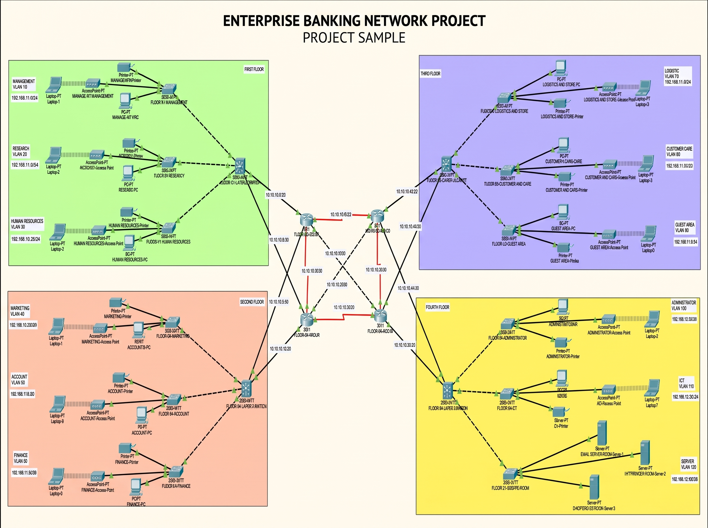
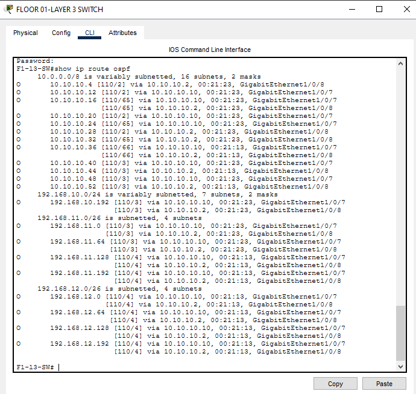
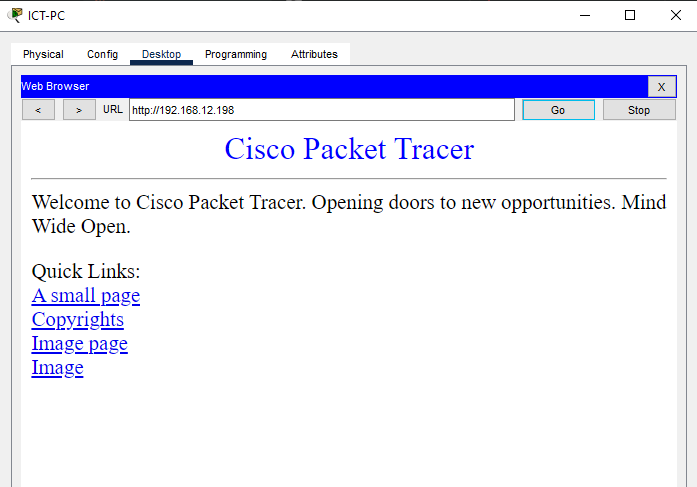
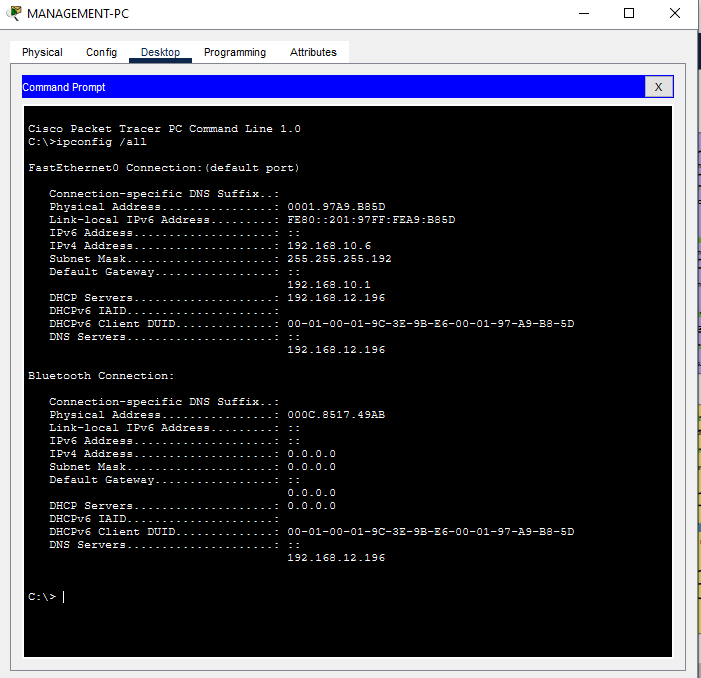
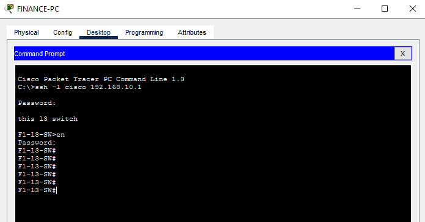

# Design, Implementation, and Troubleshooting of a Hierarchical Enterprise Network Infrastructure

## Project Overview

This project presents the design, implementation, and troubleshooting of a secure and scalable hierarchical enterprise network for a four-story banking and insurance company establishing operations.

The network was designed and simulated using **Cisco Packet Tracer**, following the **Cisco Three-Layer Hierarchical Network Design Model**, consisting of the Core, Distribution, and Access layers.

The project demonstrates practical enterprise networking concepts including OSPF dynamic routing, VLAN segmentation, inter-VLAN routing, DHCP, wireless connectivity, SSH, port security, and network troubleshooting.

---

## Network Requirements

The network was designed to satisfy the following requirements:

* Four-story enterprise building
* Multiple departments distributed across each floor
* Dedicated VLAN and subnet for each department
* Wireless connectivity for each department
* Dynamic IPv4 addressing using centralized DHCP servers
* Centralized HTTP and Email servers
* Secure remote network administration using SSH
* Port security on access switches
* Inter-VLAN communication
* Dynamic routing using OSPF
* Redundant uplinks between network layers

---

## Network Architecture

The network follows the Cisco three-layer hierarchical architecture.

### Access Layer

Layer 2 access switches provide:

* End-device connectivity
* VLAN assignment
* Access port configuration
* Port security
* Wireless access point connectivity

### Distribution Layer

Multilayer switches provide:

* Inter-VLAN routing
* Switch Virtual Interfaces (SVIs)
* Default gateways for VLANs
* Routing between departmental networks
* Connectivity between Access and Core layers

### Core Layer

Core routers provide:

* High-speed connectivity between floors
* Connectivity to the server infrastructure
* Dynamic routing using OSPF
* Redundant network paths

Each floor is connected through dual uplinks to improve network availability and redundancy.

---

## Network Topology



---

## Technologies and Concepts Implemented

| Category            | Technology / Feature                                 |
| ------------------- | ---------------------------------------------------- |
| Network Simulation  | Cisco Packet Tracer                                  |
| Network Design      | Three-Layer Hierarchical Architecture                |
| Routing Protocol    | OSPF                                                 |
| VLAN Segmentation   | Department-based VLANs                               |
| Inter-VLAN Routing  | Switch Virtual Interfaces (SVI)                      |
| IP Addressing       | VLSM-based subnetting                                |
| Dynamic Addressing  | Centralized DHCP                                     |
| DHCP Relay          | `ip helper-address`                                  |
| Network Services    | HTTP and Email                                       |
| Remote Management   | SSH                                                  |
| Port Security       | Sticky MAC / Shutdown violation                      |
| Wireless Networking | Access Points                                        |
| Device Hardening    | Password encryption, banners, hostname configuration |
| Troubleshooting     | Connectivity, routing, and interface verification    |

---

## IP Addressing Scheme

A single base network was subnetted according to the host requirements of each department.

Each department was assigned:

* A unique subnet
* A subnet mask
* A usable IP address range
* A broadcast address
* A default gateway
* A corresponding VLAN ID

### DHCP Configuration

Centralized DHCP servers were configured with individual DHCP pools for each department.

DHCP relay was implemented using:

```text
ip helper-address
```

on the appropriate Layer 3 interfaces to forward DHCP requests from departmental VLANs to the centralized DHCP server.

---

## VLAN Design

Each department was assigned a dedicated VLAN and corresponding subnet.

VLAN segmentation provides Layer 2 isolation between departments while allowing controlled Layer 3 communication through inter-VLAN routing.

The logical communication structure is:

```text
Department
    |
    v
VLAN
    |
    v
Subnet
    |
    v
SVI
    |
    v
Inter-VLAN Routing
```

---

## Routing

### OSPF

Open Shortest Path First (OSPF) was implemented as the dynamic routing protocol.

OSPF provides:

* Dynamic route discovery
* Automatic route updates
* Network convergence
* Scalable routing
* Redundant path support

Routing was verified using commands such as:

```bash
show ip route
show ip ospf neighbor
```

### OSPF Route Verification



---

## Network Security

Several security mechanisms were implemented to protect the network infrastructure.

### SSH

Secure remote administration was configured using:

* Local user authentication
* RSA key generation
* VTY line security
* SSH configuration
* Encrypted passwords

### Port Security

Access ports were protected using:

* Sticky MAC address learning
* Maximum MAC address limits
* Shutdown violation mode

Port security helps prevent unauthorized devices from connecting to protected access ports.

### Device Hardening

Basic device hardening included:

* Hostname configuration
* Login banners
* Enable and console passwords
* Password encryption
* Disabled DNS lookup

---

## Wireless Networking

Wireless Access Points were configured to provide departmental wireless connectivity.

Wireless clients were tested for:

* SSID connectivity
* DHCP address allocation
* Default gateway connectivity
* Inter-VLAN communication
* Network service accessibility

---

## Network Services

The enterprise network includes centralized network services.

### HTTP Server

The HTTP server provides web-based network services to authorized clients.



### Email Server

The Email server provides centralized email services for enterprise users.

---

## Verification and Testing

The completed network was tested to verify correct operation and end-to-end connectivity.

### Tests Performed

* End-to-end connectivity testing
* Inter-VLAN communication testing
* DHCP address allocation
* OSPF route propagation
* SSH remote access
* HTTP server accessibility
* Email service accessibility
* Wireless client connectivity
* Port security enforcement
* Interface and routing verification

### DHCP Client Verification



### SSH Verification



---

## Project Screenshots

### Full Network Topology


### OSPF Route Verification


### DHCP Client


### SSH Remote Login


### HTTP Server


---

## Repository Contents

```text
.
├── Bank project.pkt
├── README.md
└── Screenshots/
    ├── topology.png
    ├── ospf-routes.png
    ├── dhcp-client.png
    ├── ssh-login.png
    └── http-server.png
```

---

## Tools Used

* Cisco Packet Tracer — Network simulation and implementation
* Draw.io / Microsoft Visio — Logical network topology visualization

---

## Key Learning Outcomes

Through this project, I gained practical experience in:

* Enterprise network architecture
* Cisco IOS configuration
* VLAN implementation
* Inter-VLAN routing
* VLSM subnetting
* OSPF dynamic routing
* DHCP and DHCP relay
* SSH configuration
* Port security
* Wireless networking
* Network troubleshooting
* Enterprise network documentation

---

## Future Improvements

Potential future enhancements include:

* IPv6 implementation
* Access Control Lists (ACLs)
* HSRP or VRRP gateway redundancy
* Spanning Tree Protocol optimization
* Firewall implementation
* Network monitoring and logging
* SNMP-based monitoring
* Network automation using Python

---

## Author

**Savindu Sandaruwan**

Undergraduate | Information and Communication Technology

### Areas of Interest

* Network Engineering
* Network Security
* Cloud Computing
* Systems Administration
* Network Automation with Python

---

## Project Information

| Attribute           | Details                                        |
| ------------------- | ---------------------------------------------- |
| Project Type        | Academic / Enterprise Networking Project       |
| Domain              | Computer Networking and Network Infrastructure |
| Simulation Platform | Cisco Packet Tracer                            |
| Architecture        | Core – Distribution – Access                   |
| Routing Protocol    | OSPF                                           |
| Addressing          | IPv4 / VLSM                                    |
| Network Services    | DHCP, HTTP, Email                              |
| Security            | SSH, Port Security, Device Hardening           |
